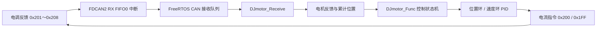

# STM32H723 DJI 电机控制工程

基于 **STM32H723ZET6 + FDCAN2 + FreeRTOS** 的 DJI 电机控制示例工程。项目实现了
M2006/C610、M3508/C620 电机反馈解析，以及电流、速度、位置和机械限位寻零等控制模式。

当前默认配置为：

- MCU：STM32H723ZET6（Cortex-M7）
- CAN 外设：FDCAN2，Classic CAN，1 Mbps
- CAN 引脚：PB12（RX）、PB13（TX）
- 操作系统：FreeRTOS，CMSIS-RTOS2 接口
- 编译环境：Keil MDK，Arm Compiler 6
- 电机数量：4 个 M2006，电机 ID 为 1～4
- 控制周期：状态机约 1 ms，监控任务约 10 ms

## 目录

1. [电机与电调](#1-电机与电调)
2. [两种 PID 算法](#2-两种-pid-算法)
3. [驱动代码框架](#3-驱动代码框架)
4. [注意事项](#4-注意事项)
5. [编译与下载](#5-编译与下载)

## 1. 电机与电调

### 1.1 支持的设备

| 电机 | 配套电调 | 默认减速比 | 本工程默认数量 |
| --- | --- | ---: | ---: |
| DJI M2006 | C610 | 36:1 | 4 |
| DJI M3508 | C620 | 3591:187 | 0 |

电机数量和类型可在 `Drive/Inc/motor.h` 中调整：

```c
#define USE_DJNUM 4
#define M2006_NUM 4
#define M3508_NUM 0
```

`M2006_NUM + M3508_NUM` 应与 `USE_DJNUM` 一致，且当前发送协议最多支持 8 个电机。

### 1.2 CAN 通信帧

工程使用 FDCAN2 的经典 CAN 模式，并将标准帧 `0x201～0x208` 过滤到 RX FIFO0。

电调反馈帧格式如下：

| 字节 | 数据 | 类型 | 说明 |
| --- | --- | --- | --- |
| 0～1 | 编码器值 | `uint16_t` | 大端序，代码中按 0～8191 处理 |
| 2～3 | 转子转速 | `int16_t` | 大端序，单位 rpm |
| 4～5 | 电流反馈 | `int16_t` | 大端序，原始值 |
| 6 | 温度 | `uint8_t` | M3508/C620 使用，单位 ℃ |
| 7 | 保留 | - | 当前未使用 |

反馈 ID 与数组下标的映射关系为：

```text
反馈 ID = 0x200 + 电机 ID
数组下标 = 电机 ID - 1
```

电流控制帧每帧可容纳 4 个电机，每个电机占 2 字节：

| 电机 ID | 发送 ID | 数据区间 |
| --- | --- | --- |
| 1～4 | `0x200` | Byte 0～7 |
| 5～8 | `0x1FF` | Byte 0～7 |

所有电流指令均采用有符号 16 位大端序编码。

### 1.3 角度和里程计算

驱动根据连续两帧编码器值计算脉冲增量。当增量绝对值超过半圈时，按编码器回绕处理：

```text
PulseGap   = PulseRead(k) - PulseRead(k-1)
PulseTotal = PulseTotal + PulseGap
angle_deg  = PulseTotal × 360 / (PulsePerRound × GearRatio × ReductionRatio)
```

其中 `PulseTotal` 使用有符号 32 位整数，可累计多圈位置；`angle_deg` 表示减速器输出轴角度。

## 2. 两种 PID 算法

工程在 `Algorithm/Src/pid.c` 中实现了位置式 PID 和增量式 PID。两者数学上相关，
但输出含义和适用场景不同。

### 2.1 位置式 PID

位置式 PID 直接计算本周期控制量：

```text
u(k) = Kp·e(k) + Ki·Σe(k) + Kd·[e(k) - e(k-1)]
```

工程中，位置环使用位置式 PID。其输出不是电流，而是速度环的目标转速：

```text
目标角度 → 位置 PID → 目标转速 → 速度 PID → 目标电流
```

### 2.2 增量式 PID

增量式 PID 计算控制量相对上一周期的变化值：

```text
Δu(k) = Kp·[e(k)-e(k-1)]
      + Ki·e(k)
      + Kd·[e(k)-2e(k-1)+e(k-2)]
```

速度环使用增量式 PID，调用方将计算结果累加到目标电流：

```c
motor->valSet.current_raw += PID_Caculate(&motor->velPID);
```

### 2.3 默认参数

每个电机初始化时使用以下参数：

| 控制环 | 类型 | Kp | Ki | Kd |
| --- | --- | ---: | ---: | ---: |
| 位置环 | 位置式 | 0.07 | 0.0005 | 0 |
| 速度环 | 增量式 | 5.5 | 0.3 | 0.01 |

这些参数仅为工程初始值。实际使用时应根据电机、负载、减速比、机构惯量和控制周期重新整定。

模式切换和寻零结束时会调用 `PID_Reset()` 清除误差历史，防止积分残留或旧控制量冲击新模式。

## 3. 驱动代码框架

### 3.1 工程目录

```text
0818_stm32h7/
├─ Algorithm/
│  ├─ Inc/pid.h                  # PID 数据结构和接口
│  └─ Src/pid.c                  # 位置式、增量式 PID
├─ Drive/
│  ├─ Inc/motor.h                # 电机结构体、参数和模式定义
│  └─ Src/motor.c                # DJI 电机驱动和状态机
├─ User/
│  ├─ Inc/app_tasks.h
│  ├─ Inc/fdCan_IRQ_Handler.h
│  ├─ Src/app_tasks.c            # FreeRTOS 任务和 CAN 接收队列
│  └─ Src/fdCan_IRQ_Handler.c    # FDCAN 启动、收发与中断回调
├─ Core/                         # STM32CubeMX 生成的初始化代码
├─ Drivers/                      # STM32 HAL 和 CMSIS
├─ Middlewares/                  # FreeRTOS 中间件
├─ MDK-ARM/                      # Keil 工程文件
└─ 0818_stm32h7.ioc             # STM32CubeMX 配置
```

### 3.2 数据流



中断回调只负责读取硬件 FIFO 并将 `CanMsg_t` 放入软件队列，解包和控制计算在任务上下文中完成。

### 3.3 核心结构体

每个 `DJMotor` 对象包含：

- `param`：编码器分辨率、机构传动比、减速比和电流限制
- `valSet`：目标电流、目标转速和目标角度
- `valNow` / `valPre`：当前反馈和上一周期反馈
- `limit`：角度、转速、电流、寻零和堵转限制
- `statusFlag`：零点、超时和堵转状态
- `posPID` / `velPID`：位置环和速度环控制器
- `MODE_Set` / `MODE_Cur`：目标模式和当前模式

驱动使用全局数组管理电机：

```c
extern DJMotor DJmotor[USE_DJNUM];
```

例如，`DJmotor[0]` 对应 CAN 电机 ID 1。

### 3.4 主要 API

| API | 作用 |
| --- | --- |
| `DJmotor_Init()` | 初始化电机参数、限制、状态和 PID |
| `DJmotor_Receive()` | 校验并解析电调反馈帧，更新角度和里程 |
| `DJmotor_Func()` | 执行模式切换、控制计算和电流发送 |
| `DJmotor_Monitor_All()` | 检测反馈超时和堵转状态 |
| `PID_Init()` | 初始化 PID 参数和模式 |
| `PID_Caculate()` | 计算位置式输出或增量式输出 |
| `PID_Reset()` | 清除误差历史 |
| `fdCan_Start()` | 启动 FDCAN2 并使能 RX FIFO0 新消息中断 |

### 3.5 初始化流程

系统启动时按以下顺序完成初始化：

1. `DJmotor_Init()` 初始化电机对象。
2. HAL、系统时钟、GPIO 和 FDCAN2 完成初始化。
3. `osKernelInitialize()` 初始化 RTOS 内核。
4. `MX_FREERTOS_Init()` 创建消息队列和电机任务。
5. `fdCan_Start()` 启动 CAN 接收。
6. `osKernelStart()` 启动任务调度。

### 3.6 FreeRTOS 任务

| 任务 | 周期/触发方式 | 职责 |
| --- | --- | --- |
| `MotorFeedbackTask` | CAN 队列触发 | 解析反馈并更新电机状态 |
| `MotorStateMachineTask` | 约 1 ms | 执行控制模式并发送电流 |
| `MotorMonitorTask` | 约 10 ms | 检测通信超时和堵转 |

CAN 接收队列深度为 8，每个元素为一个 `CanMsg_t`。

### 3.7 控制模式

`DJmotor_mode_t` 定义了五种工作模式：

| 模式 | 作用 | 主要输入 |
| --- | --- | --- |
| `DJ_Disable` | 失能并发送零电流 | 无 |
| `DJ_RPM` | 单速度环控制 | `valSet.speed_rpm` |
| `DJ_Position` | 位置环 + 速度环串级控制 | `valSet.angle_deg` |
| `DJ_Zero` | 配合机械限位进行寻零 | 寻零速度和电流限制 |
| `DJ_Current` | 直接设置电流 | `valSet.current_raw` |

#### 速度模式

```c
DJmotor[0].valSet.speed_rpm = 100;
DJmotor[0].MODE_Set = DJ_RPM;
```

API 中的目标速度是减速器输出轴转速。速度 PID 计算前会乘以机构传动比和电机减速比，
转换为转子侧转速，以减少低速计算精度损失。

#### 位置模式

```c
DJmotor[0].statusFlag.IsSetZero = true;  // 在下一次有效反馈时建立零点
DJmotor[0].valSet.angle_deg = 90.0f;
DJmotor[0].MODE_Set = DJ_Position;
```

位置模式采用串级 PID：外环根据脉冲位置误差给出目标转速，内环根据转速误差给出目标电流。
启用 `PosAngleLimitFlag` 和 `PosRPMFlag` 后，可分别限制目标角度和位置环输出速度。

#### 寻零模式

```c
DJmotor[0].limit.ZeroRPMLimit = -100;
DJmotor[0].limit.ZeroCurrentLimit_raw = 3000;
DJmotor[0].MODE_Set = DJ_Zero;
```

寻零模式应与可靠的机械限位配合使用。当编码器增量连续多个周期低于阈值时，驱动认为机构已经停止，
随后清零累计脉冲、复位 PID 并停止输出。

#### 电流模式

```c
DJmotor[0].valSet.current_raw = 500;
DJmotor[0].MODE_Set = DJ_Current;
```

直接电流模式绕过 PID，调试时应从较小指令开始，并确保机械结构具备可靠限位。

### 3.8 状态监控

监控模块包含两类保护：

- 通信超时：长时间未收到反馈后切换到 `DJ_Disable` 并置位 `Overtimeflag`
- 堵转检测：脉冲变化较小且反馈电流较大时置位 `StuckFlag`

当 `IsLooseStuck` 为 `true` 时，堵转会自动请求失能。监控阈值是经验值，部署到实际机构前需要重新验证。

## 4. 注意事项

1. **先建立零点再进入位置模式。** 从速度模式切换到位置模式前，应根据当前机械位置重新设零，避免旧累计位置导致突跳。
2. **有正负含义的数据必须使用有符号类型。** 转速、电流、角度、脉冲差和累计脉冲均可能为负数。
3. **注意大端序。** DJI 电调反馈和电流指令均为高字节在前，解包和封包时不可直接按本机字节序复制。
4. **确认电机 ID 不冲突。** 当前反馈过滤范围为 `0x201～0x208`，数组映射假定电机 ID 连续且不大于 `USE_DJNUM`。
5. **4 个电机共用一个电流控制帧。** 修改发送逻辑时必须保留各电机对应的 2 字节槽位，不能覆盖同组其他电机指令。
6. **修改电机数量时同步修改宏。** `USE_DJNUM`、`M2006_NUM` 和 `M3508_NUM` 必须保持一致。
7. **M3508 减速比应使用浮点表达式。** 若启用 M3508，建议将宏写为 `3591.0f / 187.0f`，避免整数除法丢失精度。
8. **PID 参数不可直接照搬。** 首次调试应限制电流和速度，从小幅阶跃开始，依次整定速度环和位置环。
9. **寻零必须有机械安全措施。** 设置合理的寻零方向、速度和电流上限，并准备硬件急停或断电手段。
10. **再生代码时保留用户代码。** 使用 STM32CubeMX 重新生成工程前，确认自定义代码位于 `USER CODE` 区域或独立模块中。

## 5. 编译与下载

### 5.1 环境要求

- Keil MDK 5，支持 Arm Compiler 6
- STM32H7 Device Family Pack
- 支持 STM32H723 的调试器，例如 ST-Link
- 正确接线并供电的 CAN 收发器

### 5.2 编译步骤

1. 使用 Keil 打开 `MDK-ARM/0818_stm32h7.uvprojx`。
2. 确认目标设备为 `STM32H723ZETx`，编译器为 MDK V6.18。
3. 执行 **Build**，生成的 `.axf`、`.hex`、`.map` 等文件位于 `MDK-ARM/0818_stm32h7/`。
4. 连接调试器后执行 **Download**，复位并运行程序。

编译产物、Keil 用户工作区文件和 VS Code 本地配置已经由 `.gitignore` 排除，不应提交到仓库。

## 参考资料

- DJI M2006 无刷直流减速电机及 C610 电调使用手册
- DJI M3508 P19 无刷直流减速电机及 C620 电调使用手册
- `zcw8.18.pptx`：电机通信驱动培训资料，本文档章节结构参考该文件
